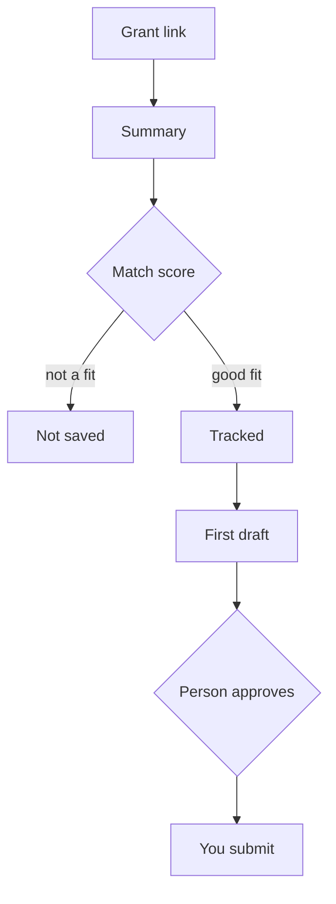

<b>Find, judge and draft grant applications faster, for small NGOs</b>

<b>Status:</b> In development &nbsp;·&nbsp; <b>Built by</b> <a href="https://github.com/Mohanad1st">Mohannad Hesham</a>

> This is a case study. The source is private because it is a product in development.

## Why I built it

Small NGOs spend more staff time than they have on finding the right grant, reading dense funder rules and writing a first draft. GrantsAI reads the call, tells you whether it fits and why, and gets you to a first draft built on your own documents.

## What it does

- Paste a grant link and get a plain summary of its requirements, funding type and eligibility.
- A match score against your organisation's profile, with the reasons.
- Saved grants with status, deadlines, tags and reminders.
- A first-draft proposal from your organisation profile and your own past documents.

## How it works

No screens yet; the product is still in development.

## What it's built on

Next.js · TypeScript · Tailwind CSS · Python (FastAPI) · PostgreSQL with vector search · LLM APIs

## Safeguards

- Nothing the AI discovers reaches the shared pool until a person reviews it.
- A person approves a drafted proposal before it counts as final.
- When an admin corrects AI-extracted grant data, the correction wins over later AI updates.
- Every AI call is metered, so spend is visible.
- Automated tests run on every push and pull request to the main branch.

## What's not solved yet

- A security review found issues that must be fixed before any launch. The automatic weekly grant discovery is built but currently failing.

## What it doesn't do

- It doesn't submit applications. It helps you decide and draft; you send.

---

© 2026 Mohannad Hesham. Showcase text and images only — no source code is published or licensed here. See all my work on <a href="https://github.com/Mohanad1st">my GitHub profile</a> · <a href="https://www.linkedin.com/in/mohannadhesham/">LinkedIn</a>.
