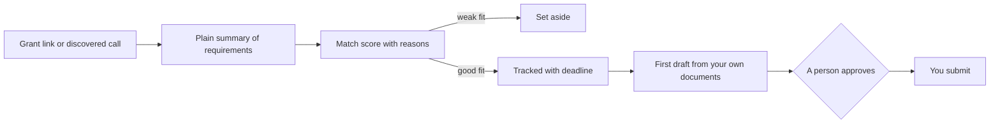

<b>Status:</b> In development &nbsp;·&nbsp; <b>Built by</b> <a href="https://github.com/Mohanad1st">Mohannad Hesham</a> &nbsp;·&nbsp; <b>Source:</b> private

> **This is a showcase, not the code.** The source is private because it is a product in development. This page shows what it does and how it was built, not the code itself. A live walkthrough is available on request.

## The problem

Small NGOs lose funding not because their work is weak, but because finding the right grant, reading dense funder rules and writing a first draft takes more staff time than they have. GrantsAI is built for the people who do that work alongside everything else: it reads the call, tells them honestly whether it fits, and gets them to a first draft grounded in their own documents.

## What it does

- Paste a grant link and get a plain summary of its requirements, funding type and eligibility
- A match score against your organisation's profile, with the reasons it fits or doesn't
- Track saved grants with status, deadlines, tags and reminders
- Generate a first-draft proposal from your organisation profile and your own past documents

## See it

How the work flows:

Screens will be added once demo data is loaded; the product is still in development.

## Built with

Next.js · TypeScript · Tailwind CSS · Python (FastAPI) · PostgreSQL with vector search · LLM APIs

## Built responsibly

- Nothing AI-discovered enters the shared pool until a person reviews it
- A person approves a drafted proposal before it is treated as final
- When an admin corrects AI-extracted grant data, the correction wins over future AI updates
- Every AI call is metered, so spend is visible
- An automated test suite runs on every change

## What it deliberately doesn't do

- It does not submit applications. It helps people decide and draft; people send.

## More from Independent builds

- [FPL War Room](https://github.com/Mohanad1st/fpl-war-room-showcase) — Six YouTubers and five blogs replaced by one number-backed weekly decision

---

© 2026 Mohannad Hesham. Showcase text and images only — no source code is published or licensed here. See all my work on <a href="https://github.com/Mohanad1st">my GitHub profile</a> · <a href="https://www.linkedin.com/in/mohannadhesham/">LinkedIn</a>.
